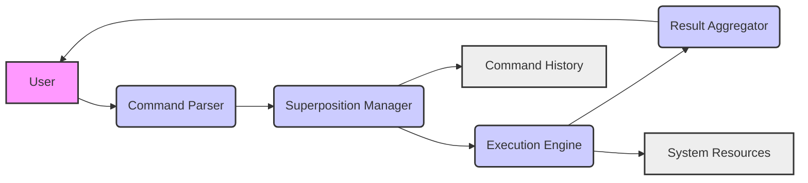

# Command Superposition Engine Design

## 1. Introduction: The Quantum Leap in CLI Interaction

This document outlines the design for a Command Superposition Engine (CSE), a novel approach to CLI interaction that leverages concepts inspired by quantum mechanics, specifically superposition, to enhance user efficiency and flexibility. The CSE allows users to define and execute multiple commands simultaneously, exploring a range of possibilities and outcomes in parallel. This design aims to provide a robust, extensible, and user-friendly system for managing and executing superposed commands.

## 2. Conceptual Foundation: Quantum Command Processing

The core concept behind the CSE is to treat CLI commands as quantum states. A user defines a "superposition" of commands, each with an associated "amplitude" (probability or weight). The engine then executes these commands in a manner that reflects their amplitudes, potentially leading to multiple outcomes that the user can then analyze and select from.

### 2.1. Key Quantum Analogies

*   **Superposition:** A user-defined set of commands, each with a specific weight or probability.
*   **Amplitude:** The weight or probability associated with each command in the superposition. This determines the relative importance or influence of each command.
*   **Measurement:** The execution of the superposed commands, resulting in a set of possible outcomes.
*   **Collapse:** The user's selection of a specific outcome from the set of possibilities, effectively "collapsing" the superposition into a single, desired state.
*   **Entanglement (Future):** The potential for commands to be linked or dependent on each other, such that the outcome of one command influences the execution or outcome of another.

## 3. System Architecture

The CSE will be implemented as a modular system with the following key components:

*   **Command Parser:** Responsible for parsing user input and identifying the commands to be superposed, along with their associated amplitudes.
*   **Superposition Manager:** Manages the creation, storage, and manipulation of command superpositions.
*   **Execution Engine:** Executes the superposed commands in a controlled and parallel manner.
*   **Result Aggregator:** Collects and aggregates the results of the executed commands.
*   **User Interface (CLI):** Provides a user-friendly interface for defining, executing, and analyzing command superpositions.

### 3.1. Component Diagram



## 4. Command Parser Design

The Command Parser will be responsible for interpreting user input and extracting the commands to be superposed, along with their associated amplitudes.

### 4.1. Input Syntax

The input syntax will follow a specific format to define command superpositions. A possible syntax is:

```
superpose [command1:amplitude1] [command2:amplitude2] ... [commandN:amplitudeN]
```

Where:

*   `superpose` is the keyword indicating a command superposition.
*   `command1`, `command2`, ..., `commandN` are the commands to be executed.
*   `amplitude1`, `amplitude2`, ..., `amplitudeN` are the amplitudes (weights) associated with each command. Amplitudes should be numerical values (e.g., 0.2, 0.5, 1.0).

**Example:**

```
superpose [ls -l:0.7] [du -sh:0.3]
```

This command superposes `ls -l` with an amplitude of 0.7 and `du -sh` with an amplitude of 0.3.

### 4.2. Parsing Logic

The parser will perform the following steps:

1.  **Tokenization:** Split the input string into tokens based on spaces and brackets.
2.  **Validation:** Verify that the input starts with the `superpose` keyword and that each command-amplitude pair is correctly formatted.
3.  **Extraction:** Extract the command and amplitude from each pair.
4.  **Normalization:** Normalize the amplitudes so that they sum to 1 (or a predefined value).
5.  **Data Structure Creation:** Create a data structure (e.g., a list of tuples) to store the superposed commands and their normalized amplitudes.

## 5. Superposition Manager Design

The Superposition Manager will be responsible for managing the creation, storage, and manipulation of command superpositions.

### 5.1. Data Structures

The Superposition Manager will use the following data structures:

*   **Superposition:** A class or struct that represents a command superposition. It will contain a list of `Command` objects and their associated amplitudes.
*   **Command:** A class or struct that represents a single command. It will contain the command string and any relevant metadata (e.g., execution status, results).

### 5.2. Functionality

The Superposition Manager will provide the following functionality:

*   **Create Superposition:** Creates a new superposition from a list of commands and amplitudes.
*   **Store Superposition:** Stores a superposition in a persistent storage (e.g., a file or database).
*   **Retrieve Superposition:** Retrieves a superposition from storage.
*   **Modify Superposition:** Modifies an existing superposition (e.g., adding, removing, or changing commands or amplitudes).
*   **List Superpositions:** Lists all stored superpositions.

## 6. Execution Engine Design

The Execution Engine will be responsible for executing the superposed commands in a controlled and parallel manner.

### 6.1. Execution Model

The Execution Engine will use a multi-threading or asynchronous execution model to execute the commands in parallel. The number of threads or asynchronous tasks will be configurable to avoid overloading the system.

### 6.2. Amplitude-Based Execution

The Execution Engine will take the amplitudes into account when executing the commands. There are several possible approaches:

*   **Probabilistic Execution:** Each command is executed with a probability proportional to its amplitude. This approach is suitable for scenarios where the user wants to explore a range of possibilities.
*   **Weighted Execution:** Each command is executed, and its results are weighted by its amplitude. This approach is suitable for scenarios where the user wants to combine the results of multiple commands.
*   **Resource Allocation:** System resources (e.g., CPU time, memory) are allocated to each command based on its amplitude. This approach is suitable for scenarios where the user wants to prioritize certain commands.

### 6.3. Error Handling

The Execution Engine will handle errors gracefully. If a command fails, the engine will log the error and continue executing the other commands. The user will be notified of any errors after the execution is complete.

## 7. Result Aggregator Design

The Result Aggregator will be responsible for collecting and aggregating the results of the executed commands.

### 7.1. Data Collection

The Result Aggregator will collect the output, exit code, and any other relevant data from each executed command.

### 7.2. Aggregation Strategies

The Result Aggregator will provide different aggregation strategies, depending on the execution model used by the Execution Engine:

*   **Probabilistic Aggregation:** The results are presented as a set of possible outcomes, each with an associated probability.
*   **Weighted Aggregation:** The results are combined based on the amplitudes of the commands.
*   **Resource-Based Aggregation:** The results are presented in a way that reflects the resource allocation for each command.

### 7.3. Result Presentation

The Result Aggregator will present the results to the user in a clear and concise manner. The results will be formatted in a way that is easy to understand and analyze.

## 8. User Interface (CLI) Design

The User Interface (CLI) will provide a user-friendly interface for defining, executing, and analyzing command superpositions.

### 8.1. Command-Line Options

The CLI will provide the following command-line options:

*   `superpose`: Defines and executes a command superposition.
*   `save`: Saves a command superposition to storage.
*   `load`: Loads a command superposition from storage.
*   `list`: Lists all stored command superpositions.
*   `modify`: Modifies an existing command superposition.
*   `help`: Displays help information.

### 8.2. Interactive Mode (Future)

In the future, the CLI could be extended to support an interactive mode, where the user can define and execute command superpositions in a more visual and intuitive way.

## 9. Technology Stack

*   **Programming Language:** Python (due to its extensive libraries for parallel processing and data analysis)
*   **Parallel Processing:** `multiprocessing` or `asyncio` (for parallel execution of commands)
*   **Data Storage:** SQLite or JSON files (for storing command superpositions)
*   **CLI Framework:** `argparse` or `click` (for creating the command-line interface)

## 10. Future Enhancements

*   **Entanglement Support:** Implement support for command entanglement, where the outcome of one command influences the execution or outcome of another.
*   **Quantum Simulation:** Explore the possibility of using quantum simulators to execute command superpositions on actual quantum hardware.
*   **GUI Interface:** Develop a graphical user interface (GUI) for the CSE.
*   **Plugin Architecture:** Design a plugin architecture that allows users to extend the functionality of the CSE.
*   **Advanced Result Analysis:** Implement advanced result analysis techniques, such as statistical analysis and machine learning.

## 11. Conclusion

The Command Superposition Engine represents a significant advancement in CLI interaction. By leveraging concepts inspired by quantum mechanics, the CSE provides users with a powerful and flexible tool for exploring a range of possibilities and outcomes in parallel. This design document provides a solid foundation for the development of a robust, extensible, and user-friendly system.