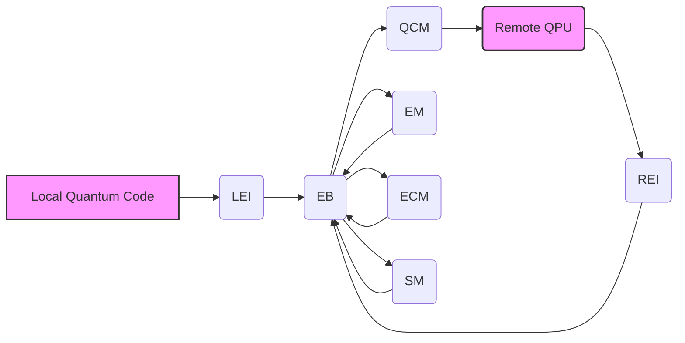

# Local-Remote Entanglement Manager Design

## 1. Introduction: Quantum State Synchronization Across Boundaries

This document details the design of a Local-Remote Entanglement Manager (LREM), a critical component for bridging the gap between local quantum code execution and remote Quantum Processing Units (QPUs) within a cloud environment. The LREM facilitates the creation, management, and monitoring of entangled quantum states distributed across local and remote systems. This entanglement enables hybrid quantum-classical algorithms, quantum cloud computing, and distributed quantum simulations.

## 2. Conceptual Foundation: Quantum Entanglement and Distributed Computing

### 2.1. Quantum Entanglement: A Primer

Quantum entanglement is a phenomenon where two or more quantum particles become linked, such that the quantum state of each particle is correlated with the others, regardless of the distance separating them. Measuring the state of one entangled particle instantaneously influences the state of the others. This correlation is the basis for quantum communication and distributed quantum computation.

### 2.2. Distributed Quantum Computing: The Need for Entanglement Management

Distributed quantum computing leverages multiple QPUs, potentially located in different physical locations, to solve problems that are too complex for a single QPU. Entanglement is crucial for coordinating computations across these distributed resources. The LREM provides the infrastructure to establish and maintain this entanglement.

### 2.3. Challenges in Local-Remote Entanglement

*   **Decoherence:** Entanglement is fragile and susceptible to decoherence, the loss of quantum information due to interaction with the environment. Long-distance entanglement is particularly vulnerable.
*   **Latency:** Communication latency between local and remote systems can significantly impact the performance of entangled quantum computations.
*   **Error Rates:** QPUs and communication channels introduce errors that can degrade the quality of entanglement.
*   **Synchronization:** Maintaining synchronization between local and remote quantum states is essential for accurate computation.
*   **Security:** Protecting entangled states from eavesdropping is crucial for secure quantum communication.

## 3. System Architecture

The LREM comprises the following key components:

*   **Local Entanglement Interface (LEI):** Provides a programming interface for local quantum code to request and interact with entangled states.
*   **Remote Entanglement Interface (REI):** Exposes an interface on the remote QPU for managing entangled states.
*   **Entanglement Broker (EB):** A central service responsible for coordinating the creation, distribution, and monitoring of entangled states.
*   **Quantum Channel Manager (QCM):** Manages the communication channels used to transmit quantum information between local and remote systems.
*   **Entanglement Monitor (EM):** Continuously monitors the quality of entangled states and detects decoherence or errors.
*   **Error Correction Module (ECM):** Implements quantum error correction protocols to mitigate the effects of noise and decoherence.
*   **Security Module (SM):** Provides security mechanisms to protect entangled states from unauthorized access and eavesdropping.

### 3.1. Component Diagram

## 4. Functional Requirements

The LREM must support the following functionalities:

*   **Entanglement Request:** Local code can request the creation of entangled states with specific properties (e.g., type of entanglement, number of qubits, error correction level).
*   **Entanglement Distribution:** The LREM distributes entangled qubits to the local and remote systems.
*   **Entanglement Management:** The LREM provides mechanisms to manage the lifecycle of entangled states, including creation, storage, and destruction.
*   **Entanglement Monitoring:** The LREM continuously monitors the quality of entangled states and provides alerts when decoherence or errors are detected.
*   **Error Correction:** The LREM applies quantum error correction protocols to maintain the integrity of entangled states.
*   **Secure Communication:** The LREM ensures secure communication of quantum information between local and remote systems.
*   **Synchronization:** The LREM synchronizes operations on entangled qubits across local and remote systems.
*   **Resource Management:** The LREM manages the allocation of quantum resources (e.g., qubits, communication channels) to entangled states.

## 5. Interface Specifications

### 5.1. Local Entanglement Interface (LEI)

The LEI provides a programming interface for local quantum code to interact with the LREM. It exposes the following functions:

*   `request_entanglement(entanglement_type, num_qubits, error_correction_level)`: Requests the creation of an entangled state.
*   `get_entangled_qubit(entanglement_id, qubit_index)`: Retrieves a reference to an entangled qubit.
*   `measure_qubit(qubit)`: Measures a qubit.
*   `apply_gate(qubit, gate)`: Applies a quantum gate to a qubit.
*   `release_entanglement(entanglement_id)`: Releases an entangled state.

### 5.2. Remote Entanglement Interface (REI)

The REI exposes an interface on the remote QPU for managing entangled states. It provides the following functions:

*   `receive_entangled_qubit(entanglement_id, qubit_index, qubit_state)`: Receives an entangled qubit from the local system.
*   `send_qubit_state(entanglement_id, qubit_index, qubit_state)`: Sends the state of a qubit to the local system.
*   `report_qubit_error(entanglement_id, qubit_index, error_type)`: Reports an error on a qubit.

### 5.3. Entanglement Broker (EB) API

The EB provides an API for managing entanglement requests and monitoring entanglement status.

*   `create_entanglement(request_id, entanglement_type, num_qubits, error_correction_level, local_id, remote_id)`: Creates a new entanglement request.
*   `assign_resources(request_id, local_qubit_ids, remote_qubit_ids, channel_id)`: Assigns quantum resources to an entanglement request.
*   `get_entanglement_status(entanglement_id)`: Retrieves the status of an entangled state.
*   `report_entanglement_error(entanglement_id, error_type, error_message)`: Reports an error on an entangled state.

## 6. Data Model

The LREM uses the following data model to represent entangled states:

*   **Entanglement:**
    *   `entanglement_id`: Unique identifier for the entangled state.
    *   `entanglement_type`: Type of entanglement (e.g., Bell state, GHZ state).
    *   `num_qubits`: Number of qubits in the entangled state.
    *   `error_correction_level`: Level of error correction applied to the entangled state.
    *   `local_qubit_ids`: List of qubit IDs on the local system.
    *   `remote_qubit_ids`: List of qubit IDs on the remote system.
    *   `status`: Current status of the entangled state (e.g., CREATED, DISTRIBUTED, ACTIVE, DECOHERED, RELEASED).
    *   `creation_timestamp`: Timestamp when the entangled state was created.
    *   `last_accessed_timestamp`: Timestamp when the entangled state was last accessed.
*   **Qubit:**
    *   `qubit_id`: Unique identifier for the qubit.
    *   `entanglement_id`: ID of the entangled state the qubit belongs to.
    *   `location`: Location of the qubit (LOCAL or REMOTE).
    *   `state`: Current state of the qubit (e.g., |0>, |1>, superposition).
    *   `error_rate`: Estimated error rate of the qubit.
*   **Quantum Channel:**
    *   `channel_id`: Unique identifier for the quantum channel.
    *   `source`: Source of the quantum channel (e.g., local system).
    *   `destination`: Destination of the quantum channel (e.g., remote QPU).
    *   `bandwidth`: Bandwidth of the quantum channel.
    *   `latency`: Latency of the quantum channel.
    *   `error_rate`: Error rate of the quantum channel.

## 7. Error Handling

The LREM implements robust error handling mechanisms to detect and recover from errors.

*   **Error Detection:** The LREM continuously monitors the quality of entangled states and detects decoherence, errors, and communication failures.
*   **Error Reporting:** The LREM reports errors to the local code and the Entanglement Broker.
*   **Error Correction:** The LREM applies quantum error correction protocols to mitigate the effects of noise and decoherence.
*   **Fault Tolerance:** The LREM is designed to be fault-tolerant, meaning that it can continue to operate even if some components fail.

## 8. Security Considerations

The LREM incorporates security mechanisms to protect entangled states from unauthorized access and eavesdropping.

*   **Authentication:** The LREM authenticates local code and remote QPUs before allowing them to access entangled states.
*   **Authorization:** The LREM authorizes access to entangled states based on predefined policies.
*   **Encryption:** The LREM encrypts quantum information transmitted between local and remote systems.
*   **Quantum Key Distribution (QKD):** The LREM can be integrated with QKD protocols to establish secure communication channels.
*   **Entanglement Purification:** The LREM can use entanglement purification techniques to improve the quality of entangled states and make them more resistant to eavesdropping.

## 9. Performance Considerations

The LREM is designed to minimize latency and maximize throughput.

*   **Low Latency Communication:** The LREM uses low-latency communication channels to transmit quantum information between local and remote systems.
*   **Parallel Processing:** The LREM uses parallel processing to accelerate the creation, distribution, and monitoring of entangled states.
*   **Caching:** The LREM caches frequently accessed data to reduce latency.
*   **Resource Optimization:** The LREM optimizes the allocation of quantum resources to minimize waste.

## 10. Deployment Architecture

The LREM can be deployed in various configurations, depending on the specific requirements of the application.

*   **Local Deployment:** All LREM components are deployed on the local system.
*   **Cloud Deployment:** All LREM components are deployed in the cloud.
*   **Hybrid Deployment:** Some LREM components are deployed on the local system, and others are deployed in the cloud.

## 11. Future Enhancements

*   **Dynamic Entanglement Management:** The LREM can be enhanced to dynamically adjust the properties of entangled states based on the needs of the application.
*   **Automated Error Correction:** The LREM can be enhanced to automatically select and apply the most appropriate error correction protocol based on the characteristics of the entangled state and the environment.
*   **Integration with Quantum Simulators:** The LREM can be integrated with quantum simulators to allow developers to test and debug their quantum code before deploying it to a real QPU.
*   **Support for Multiple QPUs:** The LREM can be extended to support entanglement between multiple QPUs.
*   **Quantum Internet Integration:** The LREM can be integrated with the quantum internet to enable secure and reliable quantum communication over long distances.

## 12. Conclusion

The Local-Remote Entanglement Manager is a critical component for enabling distributed quantum computing and hybrid quantum-classical algorithms. By providing a robust and secure infrastructure for managing entangled states, the LREM paves the way for the development of new and innovative quantum applications. This design document provides a comprehensive overview of the LREM architecture, functionality, and implementation considerations.