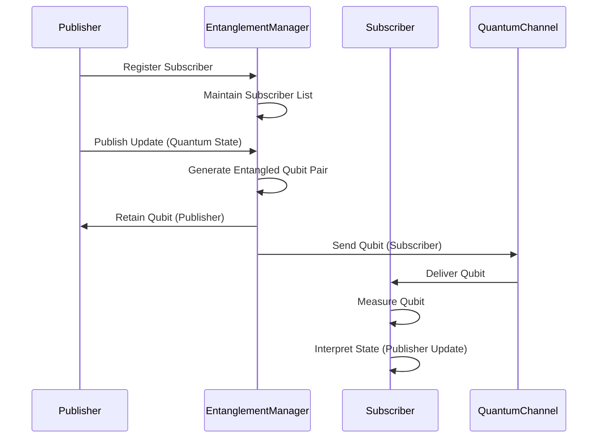

# Quantum Observer Pattern: Publisher-Subscriber Entanglement Design

## Abstract

This document outlines a novel design pattern, the "Quantum Observer Pattern," which leverages quantum entanglement to create a highly responsive and interconnected publisher-subscriber system. Unlike classical observer patterns, this approach utilizes entangled quantum states to instantaneously propagate updates between publishers and subscribers, transcending the limitations of classical communication speeds and offering unique possibilities for distributed and real-time systems.

## 1. Introduction: The Need for Quantum Observation

Classical observer patterns rely on explicit notification mechanisms, introducing latency and potential bottlenecks, especially in large-scale distributed systems. The Quantum Observer Pattern addresses these limitations by exploiting the phenomenon of quantum entanglement. When two or more particles are entangled, their fates are intertwined, regardless of the distance separating them. Measuring the state of one particle instantaneously influences the state of the others. This principle can be applied to create a publisher-subscriber system where updates from a publisher instantaneously affect all subscribed observers, creating a truly real-time and highly responsive architecture.

## 2. Conceptual Foundations: Quantum Entanglement and Superposition

### 2.1 Quantum Entanglement

Quantum entanglement is a quantum mechanical phenomenon in which the quantum states of two or more objects are linked together in such a way that one object cannot be adequately described without full mention of its counterpart, even if the objects are separated by a large distance. This leads to correlations between observable physical properties of the systems.

### 2.2 Quantum Superposition

Quantum superposition is the principle that a quantum system can exist in multiple states simultaneously until measured. This allows for encoding multiple potential states within a single quantum bit (qubit), offering exponential advantages in certain computational tasks.

### 2.3 Qubit Representation

A qubit, the quantum analogue of a classical bit, can exist in a superposition of states |0⟩ and |1⟩. Its state is described by:

|ψ⟩ = α|0⟩ + β|1⟩

where α and β are complex numbers such that |α|^2 + |β|^2 = 1. |α|^2 represents the probability of measuring the qubit in state |0⟩, and |β|^2 represents the probability of measuring the qubit in state |1⟩.

## 3. Design Architecture: Entangled Publisher-Subscriber Model

### 3.1 Core Components

*   **Quantum Publisher:** Responsible for generating and broadcasting quantum state updates. It creates entangled qubit pairs, retaining one qubit and distributing the other to subscribers.
*   **Quantum Subscriber:** Receives entangled qubits from the publisher. Measuring the state of the received qubit instantaneously reveals information about the publisher's qubit, effectively receiving the update.
*   **Entanglement Manager:** A central component responsible for managing the entanglement process, ensuring proper qubit distribution and maintaining the entanglement integrity. It can also handle subscriber registration and unregistration.
*   **Quantum Channel:** The communication channel through which entangled qubits are transmitted. This channel must be designed to minimize decoherence and maintain entanglement fidelity.

### 3.2 Entanglement Process

1.  **Publisher Initialization:** The publisher initializes a quantum state representing the update.
2.  **Entanglement Generation:** The publisher, or the Entanglement Manager, generates entangled qubit pairs. One qubit is retained by the publisher, and the other is distributed to a subscriber.
3.  **Qubit Distribution:** The Entanglement Manager distributes the entangled qubits to registered subscribers via the Quantum Channel.
4.  **Subscriber Measurement:** When the publisher's state changes, the subscriber measures its entangled qubit. Due to entanglement, the measurement outcome instantaneously reflects the publisher's state.
5.  **State Interpretation:** The subscriber interprets the measurement outcome to extract the relevant information from the publisher's update.

### 3.3 Sequence Diagram



## 4. Implementation Details

### 4.1 Quantum Computing Framework

The implementation requires a quantum computing framework such as:

*   **Qiskit (IBM):** A Python-based open-source quantum computing SDK.
*   **Cirq (Google):** A Python library for writing, manipulating, and optimizing quantum circuits.
*   **PennyLane (Xanadu):** A cross-platform Python library for quantum machine learning, automatic differentiation, and optimization of hybrid quantum-classical computations.

### 4.2 Entanglement Generation Techniques

*   **Bell State Creation:** Creating Bell states (e.g., |Φ+⟩ = (|00⟩ + |11⟩)/√2) is a common method for generating entangled qubit pairs.
*   **Controlled-NOT (CNOT) Gate:** The CNOT gate can be used to entangle two qubits.

### 4.3 Quantum Channel Considerations

*   **Decoherence Mitigation:** Quantum channels are susceptible to decoherence, which can destroy entanglement. Error correction codes and quantum repeaters can be used to mitigate decoherence effects.
*   **Fiber Optics:** Fiber optic cables can be used to transmit qubits over long distances, but they introduce signal loss and decoherence.
*   **Free-Space Optics:** Free-space optical communication can be used for shorter distances, but it is susceptible to atmospheric disturbances.

### 4.4 Example Code Snippet (Qiskit)

```python
from qiskit import QuantumCircuit, transpile, Aer, execute
from qiskit.quantum_info import Statevector
import numpy as np

# Create a Bell state circuit
circuit = QuantumCircuit(2, 2)
circuit.h(0)  # Apply Hadamard gate to qubit 0
circuit.cx(0, 1) # Apply CNOT gate with qubit 0 as control and qubit 1 as target
circuit.measure([0, 1], [0, 1])

# Simulate the circuit
simulator = Aer.get_backend('qasm_simulator')
compiled_circuit = transpile(circuit, simulator)
job = execute(compiled_circuit, simulator, shots=1000)
result = job.result()
counts = result.get_counts(circuit)
print("Bell state counts:", counts)

# Example of encoding a message (simplified)
def encode_message(message):
    # In a real system, this would involve more complex quantum encoding
    if message == 0:
        return Statevector([1, 0]) # |0>
    else:
        return Statevector([0, 1]) # |1>

# Example of decoding a message (simplified)
def decode_message(qubit_state):
    # In a real system, this would involve quantum tomography or other measurement techniques
    probabilities = np.abs(qubit_state.data)**2
    if probabilities[0] > probabilities[1]:
        return 0
    else:
        return 1

# Example usage (highly simplified)
publisher_message = 1
publisher_state = encode_message(publisher_message)

# Assume entanglement has been established (simplified)
# In reality, this would involve creating entangled pairs and distributing them

# Subscriber receives the entangled qubit (simulated)
# Subscriber measures the qubit
subscriber_message = decode_message(publisher_state) # In reality, measurement would be probabilistic

print("Publisher message:", publisher_message)
print("Subscriber received message:", subscriber_message)
```

## 5. Advantages and Disadvantages

### 5.1 Advantages

*   **Instantaneous Updates:** Entanglement enables near-instantaneous propagation of updates, surpassing the speed limitations of classical communication.
*   **High Responsiveness:** The system exhibits exceptional responsiveness to changes in the publisher's state.
*   **Enhanced Security:** Quantum key distribution techniques can be integrated to enhance the security of the communication channel.
*   **Potential for Quantum Computation Integration:** The system can be integrated with quantum computation algorithms for advanced data processing and analysis.

### 5.2 Disadvantages

*   **Decoherence:** Maintaining entanglement in the presence of environmental noise is a significant challenge.
*   **Scalability:** Scaling the system to a large number of subscribers can be complex due to the limitations of entanglement distribution.
*   **Quantum Hardware Requirements:** The implementation requires specialized quantum hardware, which is currently expensive and limited in availability.
*   **Complexity:** The design and implementation of the Quantum Observer Pattern are significantly more complex than classical observer patterns.

## 6. Use Cases

*   **High-Frequency Trading:** Instantaneous market data updates can provide a competitive edge in high-frequency trading.
*   **Real-Time Distributed Systems:** Applications requiring real-time synchronization across geographically dispersed locations, such as distributed sensor networks or collaborative simulations.
*   **Secure Communication:** Quantum key distribution can be integrated to provide secure communication channels for sensitive data.
*   **Quantum Sensor Networks:** Distributed quantum sensors can leverage entanglement to achieve higher sensitivity and accuracy.

## 7. Future Directions

*   **Development of robust quantum error correction codes:** To mitigate the effects of decoherence and improve the reliability of the system.
*   **Advancements in quantum hardware:** To improve the scalability and affordability of quantum computing resources.
*   **Exploration of novel entanglement distribution techniques:** To enable the creation of large-scale entangled networks.
*   **Integration with quantum machine learning algorithms:** To enable advanced data analysis and pattern recognition.

## 8. Conclusion

The Quantum Observer Pattern offers a revolutionary approach to publisher-subscriber communication by leveraging the unique properties of quantum entanglement. While significant challenges remain in terms of hardware requirements and decoherence mitigation, the potential benefits of instantaneous updates, high responsiveness, and enhanced security make it a promising area of research and development for future distributed systems. As quantum computing technology matures, the Quantum Observer Pattern may become a viable alternative to classical observer patterns in applications where real-time performance and security are paramount.